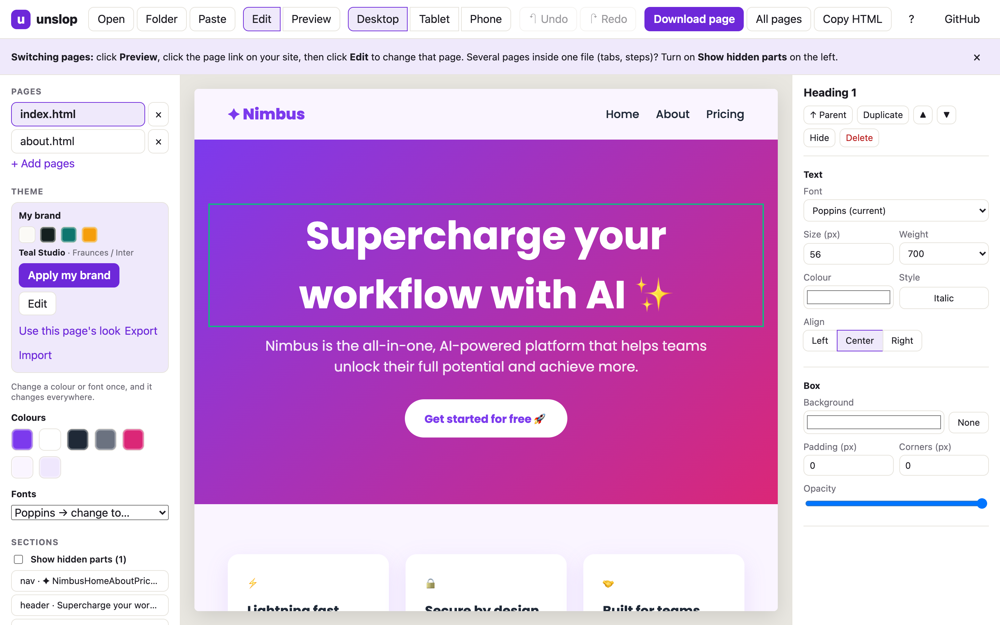
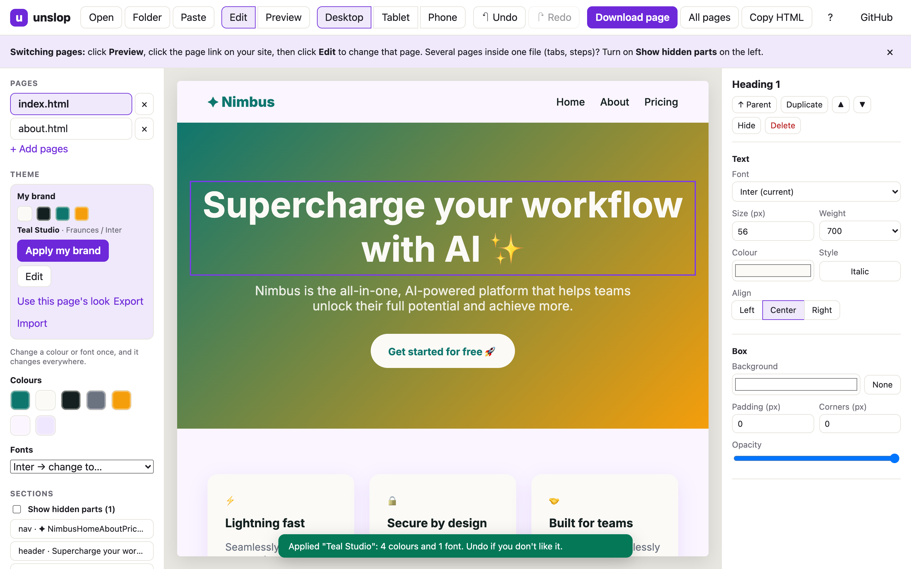

# unslop · a free visual editor for AI-generated websites

**Your AI made a website. Now make it yours.**

unslop is a free, open-source **no-code HTML editor** for pages made by AI. Drop in the HTML that Claude,
ChatGPT, Gemini, v0, Lovable, Bolt or any AI website builder made for you, and edit it like a document:
click text to type, change colors (colours) and fonts across the whole site, replace images, move and delete
sections, then download clean HTML. No account, no upload, no build step. It runs entirely in your browser.

**Works with:** Claude artifacts · ChatGPT canvas · Gemini · v0 · Lovable · Bolt · Cursor · Windsurf ·
Tailwind CDN pages · any static HTML/CSS site or landing page.

**[Open unslop →](https://kingd2925-beep.github.io/unslop/)** &nbsp;·&nbsp;
**[Download the offline version](https://github.com/kingd2925-beep/unslop/raw/main/dist/unslop.html)** (one file, double-click to open)



## Why

AI tools build a decent page in seconds. Changing one word on it usually costs another prompt, another
regeneration, and a new surprise somewhere else. unslop gives you the page back: click and change, the way
you would in a slide or a doc.

## What you can do

- **Click any text and type.** Enter finishes, Shift+Enter adds a line, pasting drops the formatting junk.
- **Change a colour or font once, everywhere.** unslop reads the page's palette and fonts. Pick a new value and every place that used it updates.
- **My Brand Kit.** Save your own colours and fonts once, in your browser. Then press *Apply my brand* on any AI-made page: unslop works out which colour is the background, the text and the accents, and swaps in yours. Export the kit as a small file to use it on another computer.
- **Style anything you select.** Font, size, weight, colour, alignment, background, padding, corners, opacity, links, image replace and alt text.
- **Rearrange.** Duplicate, move up or down, hide or delete any element. Undo and redo everything.
- **Whole sites, not just one page.** Drop several pages or a whole folder. CSS, JS and images next to them are pulled in, so the result is self-contained.
- **Hidden parts.** Tabs, wizard steps and one-file "pages" that are hidden until clicked show up with *Show hidden parts*.
- **Preview like a visitor.** The page runs normally. Click links to move between your pages, then press *Edit* to change the page you landed on.
- **Pages built by JavaScript** are turned into plain HTML you can edit, with a clear notice (and undo).
- **Tailwind-CDN pages** keep their styling while you edit.
- **Desktop, tablet and phone widths** to check your layout.
- **Download** one page as `.html`, all pages as `website.zip`, or copy the HTML.
- **Autosave** in your browser, with *Restore last session* on the start screen (online version; the offline file deliberately saves nothing, see [SECURITY.md](SECURITY.md)).
- **Fonts for everyone,** including Hindi and Devanagari faces (Hind, Mukta, Noto Sans Devanagari, Tiro Devanagari Hindi).



## How to use it

1. Open unslop ([online](https://kingd2925-beep.github.io/unslop/) or the [offline file](https://github.com/kingd2925-beep/unslop/raw/main/dist/unslop.html)).
2. Drop your page in, choose **Open files** / **Open folder**, or **Paste HTML**. No page yet? Press **Try an example**.
3. Click things and change them. Use the left panel for site-wide colours, fonts and your brand.
4. Press **Download page** (or **All pages** for a multi-page site).

**Switching pages:** click **Preview**, click the page link on your site, then click **Edit** to change that page.

### Getting the HTML out of your AI tool

| Tool | What to do |
|---|---|
| Claude (artifacts) | Open the artifact, copy its code or download it, then paste or drop it into unslop. |
| ChatGPT, Gemini, others | Copy the full HTML code block (from `<!DOCTYPE html>` to `</html>`) and use **Paste HTML**. |
| Lovable, v0, Bolt and other app builders | These make React projects, not a single HTML file. Build or export the site, then drop the output folder (usually `dist/` or `out/`). |

### Keyboard shortcuts

| Keys | Action |
|---|---|
| Ctrl/Cmd + Z | Undo |
| Ctrl/Cmd + Shift + Z, Ctrl/Cmd + Y | Redo |
| Ctrl/Cmd + S | Download this page |
| Delete / Backspace | Delete the selected element (when not typing) |
| Esc | Stop typing / clear the selection |

## FAQ

**How do I edit a website that ChatGPT or Claude made, without coding?**
Copy the HTML the AI gave you, open unslop, press **Paste HTML**, then click any text or element to change it.
Press **Download page** when you are done.

**How do I change the colors or fonts of an AI-generated landing page?**
The left panel lists every color and font the page uses. Change one and it updates everywhere on the page.
Or save your brand once in **My brand** and press **Apply my brand**.

**Can I edit a multi-page site?**
Yes. Drop several HTML files or the whole folder. Switch pages from the left panel, or in **Preview** by
clicking your own links.

**Is it free? Do I need an account?**
It is free and open source (MIT). There is no account and no server. Your files stay on your computer.

**Does it work offline?**
Yes. Download [`dist/unslop.html`](https://github.com/kingd2925-beep/unslop/raw/main/dist/unslop.html) and
double-click it.

**How is it different from a website builder like Wix or Webflow?**
Those build sites inside their platform. unslop edits the HTML file you already have and gives it back to
you, ready to host anywhere (GitHub Pages, Netlify, Vercel, your own server).

## Privacy and safety

- **Nothing leaves your computer.** There is no server. Your pages are read and saved by your own browser.
- **The pages you open cannot touch the editor.** A page is edited in a frame where its scripts are switched off, and previewed in a separate sealed frame where its scripts run but cannot reach unslop. Tests check both.
- **Fonts:** when you choose a font from the library, the page gets a Google Fonts link, the same as most websites use.

See [SECURITY.md](SECURITY.md) for the details and how to report a problem.

## Honest limitations

- React, Vue or Svelte **source** code cannot be edited directly. Drop the built output instead.
- Colours that come from Tailwind utility classes do not show in the site-wide palette. Select the element and change it in the right panel.
- A page that is built entirely by JavaScript is converted to plain HTML, so its interactive parts (menus, sliders) stop working after export.
- Images referenced by a relative path only show if you drop the image files too. They are then embedded in the page.

## For developers

No framework, no dependencies at runtime. Plain ES modules in `src/`, opened directly by `index.html`.

```bash
npm install          # installs playwright-core, used only by the browser tests
npm test             # 39 unit tests (node:test)
npm run test:e2e     # browser tests; uses your installed Chrome
npm run build        # writes dist/unslop.html, the single-file offline version
npm run serve        # serves the editor at http://localhost:8765
```

| Folder | What is in it |
|---|---|
| `src/` | The editor. `app.js` is the controller, `canvas.js` owns the sandboxed frames, `editor.js` handles selection and typing, `theme.js` / `brand.js` hold the pure logic. |
| `tests/unit/` | Pure-logic tests (colours, theme swaps, brand roles, undo, zip). |
| `tests/e2e/` | Browser tests, including the security checks and the offline build. |
| `scripts/` | `build.mjs` (single-file build) and `screenshots.mjs`. |

A ready GitHub Actions workflow that runs all of the above lives in `docs/ci-workflow.yml`
(copy it to `.github/workflows/ci.yml` to switch it on).

Contributions are welcome. Read [CONTRIBUTING.md](CONTRIBUTING.md) first.

## License

[MIT](LICENSE) © 2026 Aryan Gupta
